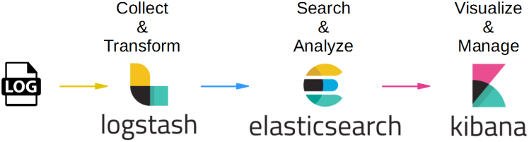
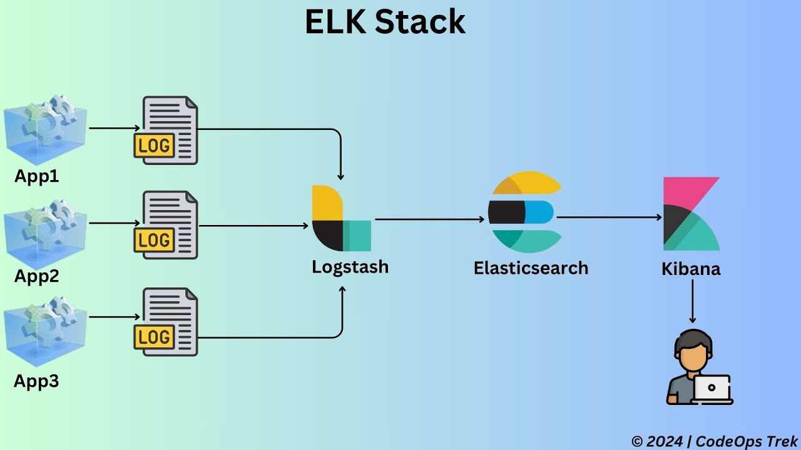

# ELK Stack (Elastic Stack): Logstash, Elasticsearch & Kibana

## Logstash ():
Chịu trách nhiệm thu thập, xử lý dữ liệu & chuyển đổi dữ liệu ...

## Elasticsearch:
Là cốt lõi, giúp ứng dụng nhanh chóng tìm kiếm & phân tích dữ liệu

## Kibana:
Chịu trách nhiệm hiển thị, phân tích, giám sát ... dữ liệu của system

